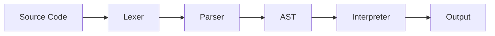

# Nex Language Architecture

## The Process Flow

---

## 1. Lexer (The Tokenizer)
**Role:** Breaks down the raw source code text into a sequence of meaningful units called **Tokens**.
- **Input:** Raw text (e.g., `var x = 10 + 5`)
- **Process:** Reads characters one by one, grouping them into types like `KEYWORD`, `IDENTIFIER`, `INT`, `PLUS`, etc.
- **Output:** A list of Tokens.
- **Key File:** `lexer/lexer.py`

*Example:*
`var x = 5` becomes `[VAR, IDENTIFIER(x), EQ, INT(5)]`

---

## 2. Parser (The Structure Builder)
**Role:** Takes the list of tokens and organizes them into a hierarchical structure called an **Abstract Syntax Tree (AST)**.
- **Input:** List of Tokens.
- **Process:** Checks if the tokens follow the language's grammar rules (syntax). It groups expressions and statements.
- **Output:** An AST (Root Node).
- **Key File:** `parser/parser.py`

*Example:*
`10 + 5` becomes a `BinOpNode` with a left `NumberNode(10)` and right `NumberNode(5)`.

---

## 3. Interpreter (The Executor)
**Role:** Traverses the AST and executes the logic defined by the nodes.
- **Input:** Abstract Syntax Tree (AST).
- **Process:** Visits each node in the tree, performing operations (math, comparisons), managing variables in the **Symbol Table**, and handling control flow (if/while).
- **Output:** The result of the program (or errors).
- **Key File:** `interpreter/interpreter.py`

---

## 4. Utils (The Helpers)
**Role:** Provides shared functionality used across the entire system to ensure consistency and reduce code duplication.
- **Components:**
    - **Constants:** Defines token types (`TT_INT`, `TT_PLUS`) and keywords.
    - **Errors:** Handles error reporting (e.g., `InvalidSyntaxError`, `RTError`) and formatting.
    - **String With Arrows:** A utility to visually point to where an error occurred in the code.
- **Key Directory:** `utils/`
